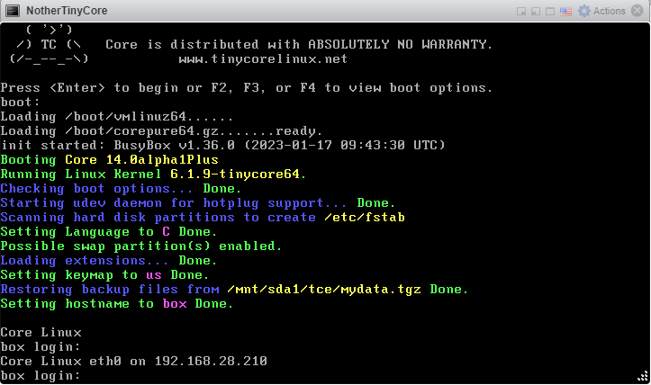

# Proposal: enhancement /usr/share/udhcpc/default.script

When using dhcp client on TinyCore, the shell script /etc/init.d/dhcp.sh is used.
One of the features of udhcpc is when an IP lease is received, it runs the (default) script
/usr/share/udhcpc/default.script

I want to propose a change to this script.

```
 ....
        renew|bound)
                /sbin/ifconfig $interface $ip $BROADCAST $NETMASK

                echo "Core Linux $interface on $ip" > /etc/issue
                killall getty

                if [ -n "$router" ] ; then
                        echo "deleting routers"
                        while route del default gw 0.0.0.0 dev $interface ; do
                                :
                        done

                        metric=0
                        for i in $router ; do
                                route add default gw $i dev $interface metric $((metric++))
                        done
                fi

                echo -n > $RESOLV_CONF
                [ -n "$domain" ] && echo search $domain >> $RESOLV_CONF
                for i in $dns ; do
                        echo adding dns $i
                        echo nameserver $i >> $RESOLV_CONF
                done
                ;;
.....
```

This result is showing the IP address on the console (login prompt).



