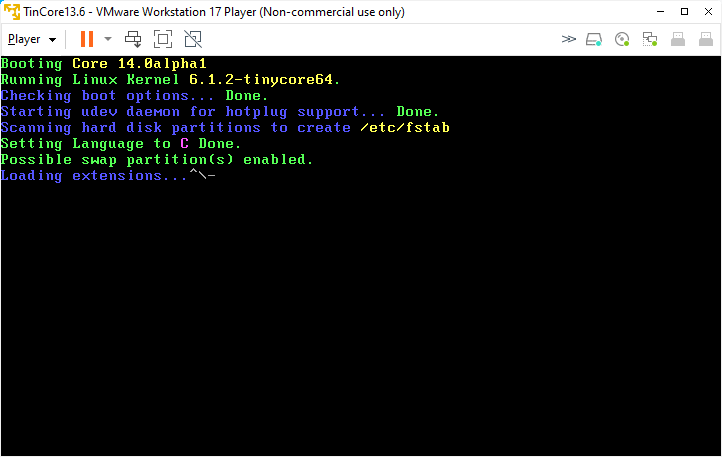

# Testing TinyCore 14.0 Alpha



This test script is used in testing Tinycore 14 alpha

```
#!/bin/bash
#
# Testing Tinycore 14 Alpha
#
# (c) Alphons van der Heijden
#
if [ "$(id -u)" -eq 0 ]; then echo "Please run as user (not root)." >&2; exit 1; fi

read -p "Clean Sytem [1] Install all again [2] " onetwo

if [[ $onetwo == "1" ]]; then
  array=(/tmp/tcloop/*)
  for dir in "${array[@]}"; do 
    sudo umount -v -l $dir  
  done

  TCE=/etc/sysconfig/tcedir
  sudo rm -rf $TCE/ondemand/*
  sudo rm -rf $TCE/optional/*
  sudo rm -rf /usr/local/tce.installed/*
  echo "" > $TCE/onboot.lst

  filetool.sh -b

 sudo reboot
fi

if [[ $onetwo == "2" ]]; then

echo "Installing packages" 

tce-load -wi bash joe libtirpc samba openssh ca-certificates rsync mkisofs-tools
tce-load -wi coreutils compiletc gcc binutils make squashfs-tools ncursesw-dev bison 
tce-load -wi flex-dev openssl-1.1.1-dev elfutils-dev gettext-dev bc perl5 python3.9 texinfo
tce-load -wi curl dotnet7-sdk mongo

echo "Packages are installed"

echo "Making the system having passwords for tc and root"

#sudo cp passwd /etc
#sudo cp shadow /etc

echo "Making samba for everyone"
  
sudo mkdir -p /usr/local/etc/samba
sudo tee /usr/local/etc/samba/smb.conf >/dev/null << "EOF"
[global]
   load printers = no
   guest account = root
   workgroup = WORKGROUP

   netbios name = tinycore14
   dns proxy = no
   max log size = 1000

   server role = standalone server
   map to guest = bad user
   usershare allow guests = yes

[Root]
   comment = All
   path = /
   read only = no
   public = yes
   guest ok = yes
EOF

echo "Basic setup for ssh"

sudo cp /usr/local/etc/ssh/ssh_config.orig /usr/local/etc/ssh/ssh_config
sudo cp /usr/local/etc/ssh/sshd_config.orig /usr/local/etc/ssh/sshd_config

echo "Creating entries in bootlocal.sh for samba and ssh"

echo "#!/bin/sh" | sudo tee /opt/bootlocal.sh >/dev/null
echo "/usr/local/etc/init.d/openssh start" | sudo tee -a /opt/bootlocal.sh >/dev/null
echo "/usr/local/etc/init.d/samba start" | sudo tee -a /opt/bootlocal.sh >/dev/null

echo "Starting ssh and samba deamon"

sudo /opt/bootlocal.sh

echo "samba and ssh are started by /opt/bootlocal.sh"

#echo "Copy .ashrc to home tc copy .joerc to home tc and root"

#cp .joerc /home/tc
#cp .ashrc /home/tc
#sudo cp .joerc /root

echo "Some default .filetool.lst for backup"

cat > /opt/filetool.lst << "EOF"
opt
home
etc/passwd
etc/shadow
usr/local/etc/ssh
usr/local/etc/samba/smb.conf
EOF

echo "Running filetool.sh -b"

filetool.sh -b

echo "--"

echo "Ready"

fi
```

# List of installed extensions

```
Filesystem      Size  Used Avail Use% Mounted on
rootfs          3.5G   35M  3.5G   1% /
tmpfs           2.0G     0  2.0G   0% /dev/shm
/dev/sda1        16G  6.1G  8.8G  41% /mnt/sda1
/dev/loop0      256K  256K     0 100% /tmp/tcloop/ncursesw
/dev/loop1      148K  148K     0 100% /tmp/tcloop/readline
/dev/loop2      544K  544K     0 100% /tmp/tcloop/bash
/dev/loop3      572K  572K     0 100% /tmp/tcloop/joe
/dev/loop4       64K   64K     0 100% /tmp/tcloop/libtirpc
/dev/loop5       24K   24K     0 100% /tmp/tcloop/attr
/dev/loop6       40K   40K     0 100% /tmp/tcloop/acl
/dev/loop7      584K  584K     0 100% /tmp/tcloop/libunistring
/dev/loop8       72K   72K     0 100% /tmp/tcloop/libidn2
/dev/loop9      244K  244K     0 100% /tmp/tcloop/gmp
/dev/loop10     272K  272K     0 100% /tmp/tcloop/nettle3
/dev/loop11      48K   48K     0 100% /tmp/tcloop/libtasn1-4
/dev/loop12      16K   16K     0 100% /tmp/tcloop/libffi
/dev/loop13     716K  716K     0 100% /tmp/tcloop/p11-kit
/dev/loop14     1.2M  1.2M     0 100% /tmp/tcloop/gnutls35
/dev/loop15     312K  312K     0 100% /tmp/tcloop/pcre
/dev/loop16     1.5M  1.5M     0 100% /tmp/tcloop/glib2
/dev/loop17     2.1M  2.1M     0 100% /tmp/tcloop/gcc_libs
/dev/loop18      24K   24K     0 100% /tmp/tcloop/libcap
/dev/loop19     1.2M  1.2M     0 100% /tmp/tcloop/elogind
/dev/loop20      80K   80K     0 100% /tmp/tcloop/expat2
/dev/loop21     272K  272K     0 100% /tmp/tcloop/dbus
/dev/loop22     176K  176K     0 100% /tmp/tcloop/libavahi
/dev/loop23     248K  248K     0 100% /tmp/tcloop/libcups
/dev/loop24      32K   32K     0 100% /tmp/tcloop/samba-libs
/dev/loop25      14M   14M     0 100% /tmp/tcloop/samba
/dev/loop26     1.8M  1.8M     0 100% /tmp/tcloop/openssl-1.1.1
/dev/loop27     1.4M  1.4M     0 100% /tmp/tcloop/openssh
/dev/loop28     148K  148K     0 100% /tmp/tcloop/ca-certificates
/dev/loop29     312K  312K     0 100% /tmp/tcloop/rsync
/dev/loop30     384K  384K     0 100% /tmp/tcloop/mkisofs-tools
/dev/loop31     692K  692K     0 100% /tmp/tcloop/glibc_add_lib
/dev/loop32      96K   96K     0 100% /tmp/tcloop/zlib_base-dev
/dev/loop33      28K   28K     0 100% /tmp/tcloop/util-linux_base-dev
/dev/loop34     2.2M  2.2M     0 100% /tmp/tcloop/linux-6.1_api_headers
/dev/loop35     4.0M  4.0M     0 100% /tmp/tcloop/glibc_base-dev
/dev/loop36     336K  336K     0 100% /tmp/tcloop/e2fsprogs_base-dev
/dev/loop37      48K   48K     0 100% /tmp/tcloop/sed
/dev/loop38      56K   56K     0 100% /tmp/tcloop/pkg-config
/dev/loop39      76K   76K     0 100% /tmp/tcloop/patch
/dev/loop40     120K  120K     0 100% /tmp/tcloop/make
/dev/loop41     112K  112K     0 100% /tmp/tcloop/m4
/dev/loop42      64K   64K     0 100% /tmp/tcloop/grep
/dev/loop43     532K  532K     0 100% /tmp/tcloop/libzstd
/dev/loop44     816K  816K     0 100% /tmp/tcloop/isl
/dev/loop45     280K  280K     0 100% /tmp/tcloop/mpfr
/dev/loop46      56K   56K     0 100% /tmp/tcloop/mpc
/dev/loop47     116K  116K     0 100% /tmp/tcloop/flex
/dev/loop48     6.0M  6.0M     0 100% /tmp/tcloop/binutils
/dev/loop49     4.2M  4.2M     0 100% /tmp/tcloop/gcc_libs-dev
/dev/loop50     2.0M  2.0M     0 100% /tmp/tcloop/gcc_base-dev
/dev/loop51      58M   58M     0 100% /tmp/tcloop/gcc
/dev/loop52     360K  360K     0 100% /tmp/tcloop/gawk
/dev/loop53     144K  144K     0 100% /tmp/tcloop/findutils
/dev/loop54      28K   28K     0 100% /tmp/tcloop/bzip2-lib
/dev/loop55      88K   88K     0 100% /tmp/tcloop/liblzma
/dev/loop56     596K  596K     0 100% /tmp/tcloop/file
/dev/loop57     132K  132K     0 100% /tmp/tcloop/diffutils
/dev/loop58     1.6M  1.6M     0 100% /tmp/tcloop/gettext
/dev/loop59     476K  476K     0 100% /tmp/tcloop/bison
/dev/loop60     4.0K  4.0K     0 100% /tmp/tcloop/compiletc
/dev/loop61     2.3M  2.3M     0 100% /tmp/tcloop/coreutils
/dev/loop62      56K   56K     0 100% /tmp/tcloop/lzo
/dev/loop63     116K  116K     0 100% /tmp/tcloop/squashfs-tools
/dev/loop64     104K  104K     0 100% /tmp/tcloop/ncursesw-dev
/dev/loop65     4.0K  4.0K     0 100% /tmp/tcloop/flex-dev
/dev/loop66     2.4M  2.4M     0 100% /tmp/tcloop/openssl-1.1.1-dev
/dev/loop67      20K   20K     0 100% /tmp/tcloop/bzip2
/dev/loop68      32K   32K     0 100% /tmp/tcloop/bzip2-dev
/dev/loop69      80K   80K     0 100% /tmp/tcloop/liblzma-dev
/dev/loop70     552K  552K     0 100% /tmp/tcloop/elfutils
/dev/loop71     384K  384K     0 100% /tmp/tcloop/elfutils-dev
/dev/loop72     456K  456K     0 100% /tmp/tcloop/gettext-dev
/dev/loop73      64K   64K     0 100% /tmp/tcloop/bc
/dev/loop74      17M   17M     0 100% /tmp/tcloop/perl5
/dev/loop75      80K   80K     0 100% /tmp/tcloop/gdbm
/dev/loop76     532K  532K     0 100% /tmp/tcloop/sqlite3
/dev/loop77      17M   17M     0 100% /tmp/tcloop/python3.9
/dev/loop78     2.2M  2.2M     0 100% /tmp/tcloop/texinfo
/dev/loop79      14M   14M     0 100% /tmp/tcloop/icu67
/dev/loop80     210M  210M     0 100% /tmp/tcloop/dotnet7-sdk
/dev/loop81      93M   93M     0 100% /tmp/tcloop/mongo
/dev/loop82     284K  284K     0 100% /tmp/tcloop/curl
```

# Functional tests

- starting samba (shares / to everyone as root for testing)
- starting ssh (ssh login works)
- compiling kernel Linux-6.1.2 (making new iso and booting)
- making and executing dotnet console program
- starting mongo database


